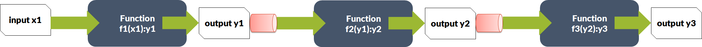
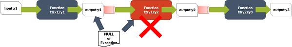

Masha Foundation (MF) is a .NET library that enables you to use functional programing idioms in your C# application.
## Benefits
- Highly readable code
- Easy to debug and less error-prone
- Improve developer productivity

# Installation
.NET Standard 2.0 compatible.

Install
- via package manager `Install-Package Masha.Foundation`
- via .NET CLI `dotnet add package Masha.Foundation`
- package reference `<PackageReference Include="Masha.Foundation" Version="0.1.1" />`

# Quick Start
The functional programming language idioms are drawing attention over object-oriented programming languages.  C# incorporated high order functions, currying and partial applications.  The left over idiom is function pipelining.  It is the game changer to make you think efficiently while writing application.

`Masha.Foundation` is a C# library enables to use functional programming language idioms including function pipelining.

## Pipelining and Monads

An parameter `x1` passed to the function `f1` which returns `y1`.  `y1` is parameter to function `f2`, so on.  Functions should be non-void to achieve function pipelining.  Creating a function pipelining is quite possible in C# without using any special construct.  ***The problem with plain function pipelining is breaking the pipelines by throwing exceptions and returning NULL value parameters as shown below***.

The cylindrical shape in the above diagrams helps to fix this problem.  They are called as **monads**.  These enables to connect functions and pass the parameters safely.

Masha.Foundation (shortly ***MF***) currently provides following monads:
- Option
- Result

### Map() and Match() Functions
Monads actually wraps a plain .NET object and elevate them so that the upcoming functions in the pipeline can safely peek the value and use it.  Interestingly you don't need to check NULL or exception on every step in the programs.  Monads can handle them and easily construct a function pipelining by `Map()` function.  To peek a value (plain .NET object) from a monad you can use `Match()` function.

## Option
Option elevates an object and returns `Some(object)` if it has value, otherwise `None`.

Let us consider a `IUserRepository` which has a method `FindById()` to get an user by his/her ID.

    User FindById(int userId); // typical approach
    Option<User> FindById(int userId); // MF approach

Let us assume `User` has a property `Gender` and you want to know the gender an user.

    // typical approach
    var repo = new UserRepository();
    User user = repo.FindById(1234);
    if(user != null) {
        return user.Gender;
    }else {
        // throw new Exception
    }

    // MF approach
    return new UserRepository()
        .FindById(1234)
        .Map(user => user.Gender);

### Usage

To elevate a plain object:

    var user = Some(plainUser);

To peek the value from Option:

    user.Match(Some: usr => usr.Gender, None: () => "Not Given");
    
    // or using GetOrElse
    string gender = Some(user).GetOrElse("Not Given");

`Some` and `None` are named arguments of `Match()`.

## Result
Result is more safer than Option while handling plain objects.  It elevates and also encapsulates Error so that the caller will get error details if plain object is NULL.  This way without exception handling, you can safely pass plain object from innermost layer to top layer.

A result monad has two values:
- Actual plain object or None
- Error if actual object is None

To elevate:
    
    var plainUser = new User("Abdul Basid");
    var user = Result(plainUser); // elevated using Result()

To return as function value:

    // consider UserRepository.FindByUserId()
    Result<User> FindByUserId(int userId) {
        var query = // find the user in DB;

        // If your Repository foundation API uses MF, you even don't need to write this NULL handling logic.
        if(query is Good ) {
            return query.User; // automatic Result<User> casting happens
        } else {
            return Error.Of(10010); // assume you are using error code in your application
        }
    }

To use it in pipeline:

    new UserRepository()
        .FindByUserId(1234)
        .Map(u => u.Gender);

To peek the value at top most layer of your application:

     repo
        .FindByUserId(1234)
        .Match(pass: (v) => $"Hi, {v.Name})",
               fail: (f) => "Sorry, we are not able to find your details");

    // or GetOrElse
    repo
        .FindByUserId(1234)
        .GetOrElse(EmptyUser());

`pass` and `fail` are named arguments of `Match()`.

# Detail Developer Guide

_In progress_